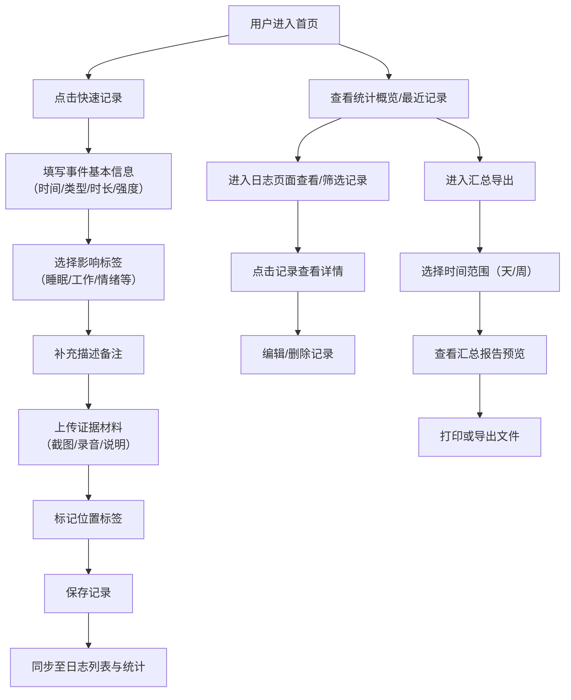

## 1. 产品概述

租房噪音记录册是一款面向租房人群的噪音事件记录与管理工具，帮助用户系统化地记录楼上噪音、装修扰民、夜间打扰等干扰事件，整理证据并生成可打印的汇总报告，用于与房东、物业或相关部门沟通维权。

- 核心用户：租房青年、宿舍居民
- 核心价值：将零散的噪音困扰转化为有条理、可追溯、可呈现的证据材料

## 2. 核心功能

### 2.1 用户角色

| 角色 | 注册方式 | 核心权限 |
|------|----------|----------|
| 普通用户 | 无需注册，本地使用 | 创建、编辑、删除噪音记录；上传证据；生成并导出汇总报告 |

### 2.2 功能模块

1. **首页仪表盘**：今日统计卡片、快速记录入口、最近记录列表、统计概览图表
2. **噪音日志页面**：按日期时间轴展示全部记录、筛选搜索功能、新增/编辑/删除记录
3. **记录详情页**：完整事件信息、影响标签展示、证据材料列表、位置标签
4. **汇总导出页面**：按天/周统计视图、可打印预览、PDF/文本导出功能

### 2.3 页面详情

| 页面名称 | 模块名称 | 功能描述 |
|----------|----------|----------|
| 首页仪表盘 | 统计卡片区域 | 展示本周噪音事件次数、受扰时长、最常见影响标签、夜间打扰次数 |
| 首页仪表盘 | 快速记录入口 | 一键创建新噪音记录，支持快速填写常用字段 |
| 首页仪表盘 | 最近记录列表 | 展示最近5条噪音记录，支持点击查看详情和快速编辑 |
| 首页仪表盘 | 统计图表 | 展示近7天噪音事件趋势柱状图和影响标签分布饼图 |
| 噪音日志 | 筛选搜索栏 | 按日期范围、时间段、噪音类型、影响标签进行筛选和关键词搜索 |
| 噪音日志 | 时间轴列表 | 按日期倒序分组展示噪音记录，每条显示核心信息摘要 |
| 噪音日志 | 新增记录弹窗 | 完整表单：日期、开始/结束时间、噪音类型、持续时长、影响标签、强度等级、描述备注、证据上传、位置标签 |
| 记录详情 | 基本信息展示 | 事件时间、类型、时长、强度等核心字段的卡片式展示 |
| 记录详情 | 影响标签区域 | 以彩色标签形式展示所有选中的影响类别，支持添加/移除 |
| 记录详情 | 证据整理区 | 展示上传的图片截图缩略图、录音文件、备注说明，支持预览和删除 |
| 记录详情 | 位置标签 | 地图/文本形式展示噪音发生位置（楼上/隔壁/楼下/户外等） |
| 汇总导出 | 统计视图切换 | 支持按天、按周、按月切换统计维度 |
| 汇总导出 | 汇总内容展示 | 时间段总览、事件统计、影响分类汇总、证据清单、详细事件列表 |
| 汇总导出 | 打印预览 | 适配A4纸张的打印样式预览，支持页眉页脚配置 |
| 汇总导出 | 导出功能 | 导出为可打印HTML文件，一键触发浏览器打印 |

## 3. 核心流程

用户打开应用后，首先在首页查看今日和本周的噪音统计概览。当发生噪音干扰时，用户点击快速记录按钮，填写事件发生时间、噪音类型、持续时长，选择受扰影响标签（如睡眠中断、工作受扰、情绪烦躁等），可补充文字描述并上传截图、录音等证据材料，标记噪音来源位置。记录保存后自动同步至日志列表和统计数据。需要维权或沟通时，用户进入汇总导出页面，选择时间范围（按天或按周），系统自动生成结构化的汇总报告，包含事件统计、影响分析、完整事件列表和证据索引，用户可预览打印样式后直接打印或导出为文件。

## 4. 用户界面设计

### 4.1 设计风格

- **主色调**：深青色系 #1a3a4a 作为主色，传达冷静、理性的情绪；辅助色为暖橙色 #ff7a45，用于警示和重点强调（夜间打扰、高强度噪音）；中性色采用米灰 #f5f3ef 营造温暖舒适感
- **按钮风格**：圆角 8px 的胶囊按钮，主按钮采用深色填充 + 浅色文字，次要按钮采用描边样式，悬停时有微上浮和阴影变化
- **字体**：标题使用 Lora（优雅衬线字体）增强记录感和正式感，正文使用 Noto Sans SC 保证中文可读性
- **布局风格**：左侧导航栏 + 右侧主内容区的经典后台布局，卡片采用圆角 12px 设计，带有柔和阴影和细线边框，内容区保持充足留白
- **图标风格**：使用 Lucide React 线性图标，搭配柔和色彩填充，营造简洁现代的视觉体验

### 4.2 页面设计概述

| 页面名称 | 模块名称 | UI 元素 |
|----------|----------|---------|
| 首页仪表盘 | 统计卡片区域 | 4个并列数据卡片，每个包含图标、数值、环比变化小箭头，背景使用不同的淡色渐变，hover时卡片轻微上浮 |
| 首页仪表盘 | 快速记录入口 | 顶部右侧醒目的橙色悬浮按钮 + 页面内卡片式快捷入口，点击展开全屏表单弹窗 |
| 首页仪表盘 | 最近记录列表 | 时间轴样式列表，左侧彩色圆点标识噪音类型，右侧展示时间、时长、影响标签摘要 |
| 首页仪表盘 | 统计图表 | 左侧7天趋势柱状图（带渐变填充），右侧标签分布环形图，统一使用白卡背景 + 12px圆角 |
| 噪音日志 | 筛选搜索栏 | 顶部固定筛选条，包含日期选择器、类型下拉、标签多选、搜索框，采用白底 + 细边设计 |
| 噪音日志 | 时间轴列表 | 按日期分组的卡片列表，日期头采用衬线大字加粗，每条记录为白底卡片带左边界颜色条（对应类型） |
| 噪音日志 | 新增记录弹窗 | 居中模态弹窗，分步骤分区段表单，字段间有清晰的视觉分组和辅助说明，顶部步骤指示器 |
| 记录详情 | 基本信息展示 | 顶部大卡片展示事件标题和核心信息，采用左右两列布局，关键数据用大号字突出 |
| 记录详情 | 影响标签区域 | 灵活的标签云布局，每个标签为圆角胶囊样式，不同影响类别使用不同配色方案 |
| 记录详情 | 证据整理区 | 网格布局展示图片缩略图，录音文件为波形条样式，支持点击预览大图/播放 |
| 记录详情 | 位置标签 | 带图标的胶囊标签，位置类型有对应的示意图标和描述文本 |
| 汇总导出 | 统计视图切换 | 顶部分段控制器（Segemented Control）样式的天/周/月切换按钮组 |
| 汇总导出 | 汇总内容展示 | 仿打印纸张效果的白色区域（带阴影和页边虚线），正式排版的报告标题、统计表格、详细列表 |
| 汇总导出 | 打印预览 | 应用 print.css 媒体样式，A4尺寸预览框，分页指示器 |
| 汇总导出 | 导出功能 | 顶部固定操作栏，包含打印、导出HTML两个主按钮，带下拉箭头的更多选项 |

### 4.3 响应式设计

采用桌面端优先设计，主内容区最大宽度 1280px，水平居中布局：

- **桌面端（≥1024px）**：左侧固定 240px 导航栏，右侧主内容区采用双列或三列网格布局
- **平板端（768px-1023px）**：导航栏收窄为 64px 图标栏，主内容区双列布局，统计图表改为堆叠
- **移动端（<768px）**：导航转为底部 Tab 栏，所有卡片改为单列堆叠，表单弹窗全屏展示，表格类内容支持横向滚动

### 4.4 微交互与动效

- 页面加载：卡片采用从下向上的交错淡入动画（staggered fade-in-up），delay 50ms 递进
- 卡片交互：hover 时 transform: translateY(-2px) + 阴影加深，过渡时间 200ms
- 标签选择：选中时带弹性缩放动画（scale 0.95 → 1.05 → 1）
- 新增记录：保存成功后触发绿色勾号对号动画，弹窗平滑收起
- 统计图表：数据首次渲染时柱状图从底部生长，环形图从零展开
