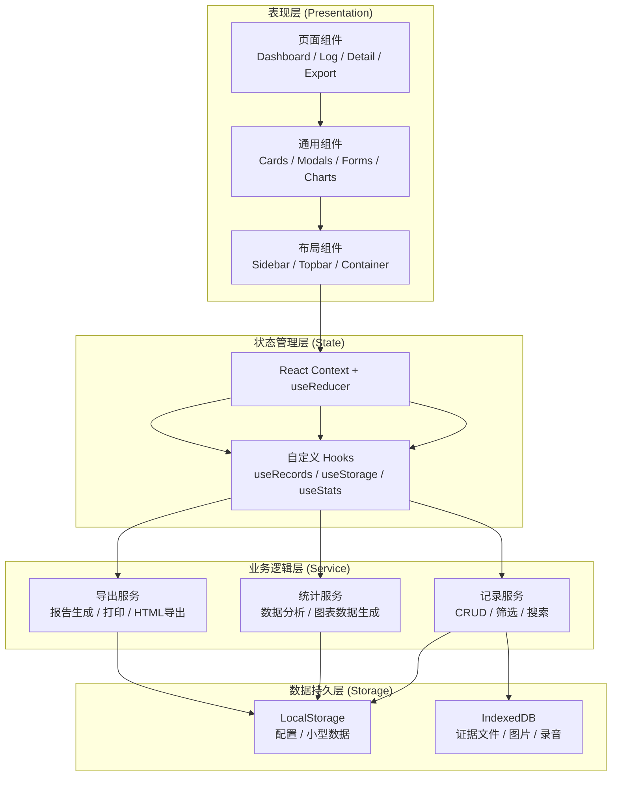
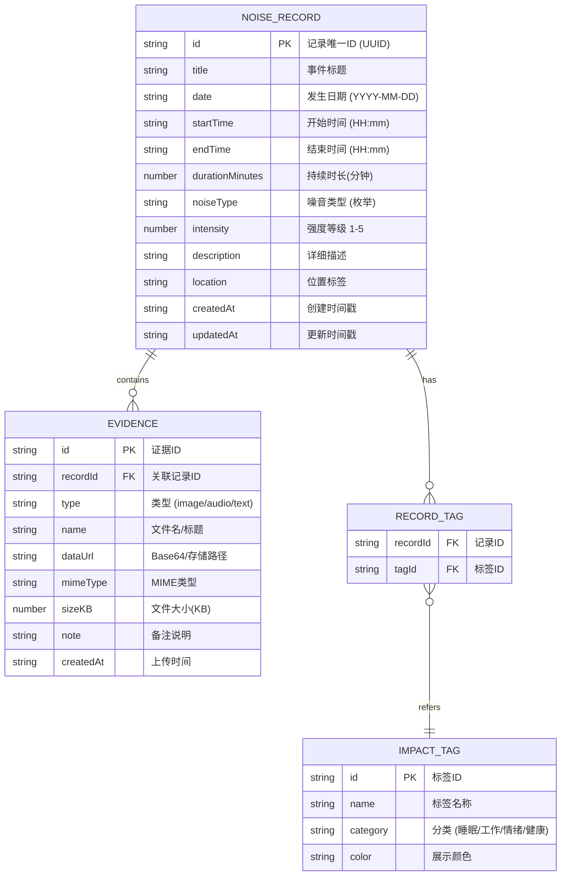

## 1. 架构设计

本项目为纯前端单页应用（SPA），所有数据存储在浏览器本地（LocalStorage + IndexedDB），无需后端服务。架构分层清晰，便于维护和扩展。



## 2. 技术选型说明

| 类别 | 技术选择 | 版本 | 选型理由 |
|------|----------|------|----------|
| 构建工具 | Vite | ^5.0 | 极速冷启动和热更新，现代前端构建新标准 |
| 前端框架 | React | ^18.2 | 组件化开发，生态成熟，Hooks API 适合状态管理 |
| 语言 | TypeScript | ^5.3 | 类型安全，提升开发质量和可维护性 |
| 样式方案 | Tailwind CSS | ^3.4 | 原子化CSS，快速构建UI，与设计系统高度契合 |
| 路由 | React Router DOM | ^6.21 | React 生态标准路由方案，支持嵌套路由和懒加载 |
| 图标 | Lucide React | ^0.344 | 现代线性图标库，轻量且一致性好 |
| 图表 | Recharts | ^2.12 | 基于 React 的图表库，支持响应式，配置灵活 |
| 状态管理 | Context + useReducer | React内置 | 中小项目足够使用，避免引入额外依赖 |
| 本地存储 | LocalStorage | 浏览器原生 | 存储JSON格式的记录元数据，简单直接 |
| 文件存储 | IndexedDB (dexie) | ^4.0 | 用于存储上传的图片和录音文件，支持大容量二进制数据 |
| 日期处理 | date-fns | ^3.3 | 轻量级日期工具库，Tree-shakable，比 moment 更现代 |

## 3. 路由定义

| 路由路径 | 页面名称 | 组件路径 | 功能说明 |
|----------|----------|----------|----------|
| `/` | 首页仪表盘 | `pages/Dashboard.tsx` | 统计概览、快速记录、最近记录列表、图表展示 |
| `/log` | 噪音日志 | `pages/NoiseLog.tsx` | 全部记录时间轴、筛选搜索、记录管理 |
| `/log/:id` | 记录详情 | `pages/RecordDetail.tsx` | 单条记录完整信息、证据查看、编辑入口 |
| `/export` | 汇总导出 | `pages/ExportReport.tsx` | 时间范围选择、报告预览、打印和导出 |
| `*` | 404 重定向 | 重定向至 `/` | 无效路径跳转首页 |

## 4. 核心数据模型

### 4.1 实体关系图



### 4.2 类型定义 (TypeScript)

```typescript
// 噪音类型枚举
export type NoiseType = 
  | 'footsteps'      // 脚步声/走路
  | 'furniture'      // 家具拖拽
  | 'decoration'     // 装修施工
  | 'music'          // 音乐/电视
  | 'talking'        // 大声说话/争吵
  | 'animals'        // 宠物叫声
  | 'plumbing'       // 水管/排水
  | 'door'           // 摔门/电梯
  | 'outdoor'        // 户外噪音
  | 'other';         // 其他

// 位置标签枚举  
export type LocationTag =
  | 'upstairs'       // 楼上
  | 'downstairs'     // 楼下
  | 'next_door'      // 隔壁
  | 'same_room'      // 同屋
  | 'hallway'        // 走廊
  | 'outdoor'        // 户外
  | 'unknown';       // 不确定

// 影响标签分类
export type ImpactCategory = 'sleep' | 'work' | 'emotion' | 'health';

export interface ImpactTag {
  id: string;
  name: string;
  category: ImpactCategory;
  color: string;
}

export interface Evidence {
  id: string;
  recordId: string;
  type: 'image' | 'audio' | 'text';
  name: string;
  dataUrl: string;
  mimeType: string;
  sizeKB: number;
  note?: string;
  createdAt: string;
}

export interface NoiseRecord {
  id: string;
  title: string;
  date: string;           // YYYY-MM-DD
  startTime: string;      // HH:mm
  endTime: string;        // HH:mm
  durationMinutes: number;
  noiseType: NoiseType;
  intensity: 1 | 2 | 3 | 4 | 5;
  description: string;
  location: LocationTag;
  impactTagIds: string[];
  evidenceIds: string[];
  createdAt: string;
  updatedAt: string;
}

// 统计数据类型
export interface DailyStats {
  date: string;
  count: number;
  totalMinutes: number;
  avgIntensity: number;
}

export interface TagStats {
  tagId: string;
  tagName: string;
  count: number;
  color: string;
}

export interface TimeRangeStats {
  morning: number;    // 06:00-12:00
  afternoon: number;  // 12:00-18:00
  evening: number;    // 18:00-22:00
  night: number;      // 22:00-06:00
}
```

## 5. 项目目录结构

```
/
├── public/                      # 静态资源
│   └── favicon.svg
├── src/
│   ├── assets/                  # 图片、字体等资源
│   │   └── fonts/               # Lora & Noto Sans SC 字体文件
│   ├── components/              # 通用可复用组件
│   │   ├── layout/              # 布局组件
│   │   │   ├── Sidebar.tsx      # 左侧导航栏
│   │   │   ├── Topbar.tsx       # 顶部工具栏
│   │   │   └── AppLayout.tsx    # 主布局容器
│   │   ├── records/             # 记录相关组件
│   │   │   ├── RecordCard.tsx
│   │   │   ├── RecordForm.tsx   # 新增/编辑表单
│   │   │   ├── RecordFormModal.tsx
│   │   │   ├── ImpactTagPicker.tsx
│   │   │   ├── EvidenceUploader.tsx
│   │   │   └── LocationPicker.tsx
│   │   ├── stats/               # 统计图表组件
│   │   │   ├── StatCard.tsx
│   │   │   ├── TrendChart.tsx
│   │   │   └── TagDistribution.tsx
│   │   └── ui/                  # 基础UI组件
│   │       ├── Button.tsx
│   │       ├── Modal.tsx
│   │       ├── Badge.tsx
│   │       ├── Input.tsx
│   │       ├── Select.tsx
│   │       └── DatePicker.tsx
│   ├── constants/               # 常量配置
│   │   ├── noiseTypes.ts        # 噪音类型配置
│   │   ├── impactTags.ts        # 影响标签配置
│   │   └── locations.ts         # 位置标签配置
│   ├── context/                 # React Context
│   │   └── RecordsContext.tsx   # 记录状态全局管理
│   ├── hooks/                   # 自定义 Hooks
│   │   ├── useRecords.ts        # 记录CRUD操作
│   │   ├── useStatistics.ts     # 统计计算
│   │   └── useLocalStorage.ts   # 本地存储
│   ├── pages/                   # 页面组件
│   │   ├── Dashboard.tsx        # 首页仪表盘
│   │   ├── NoiseLog.tsx         # 噪音日志列表
│   │   ├── RecordDetail.tsx     # 记录详情页
│   │   └── ExportReport.tsx     # 汇总导出页
│   ├── services/                # 业务逻辑服务
│   │   ├── exportService.ts     # 报告生成与导出
│   │   └── statsService.ts      # 统计分析服务
│   ├── types/                   # TypeScript 类型定义
│   │   └── index.ts
│   ├── utils/                   # 工具函数
│   │   ├── dateUtils.ts
│   │   ├── formatUtils.ts
│   │   └── idUtils.ts
│   ├── App.tsx                  # 根组件，路由配置
│   ├── main.tsx                 # 入口文件
│   └── index.css                # 全局样式 + Tailwind 指令
├── index.html
├── vite.config.ts
├── tsconfig.json
├── tailwind.config.js
├── postcss.config.js
└── package.json
```

## 6. 状态管理方案

### 6.1 RecordsContext 结构

使用 React Context + useReducer 管理全局记录状态，避免 props drilling：

```
State 结构:
{
  records: NoiseRecord[],        // 所有记录数组
  evidence: Evidence[],          // 所有证据
  tags: ImpactTag[],             // 标签定义
  filters: {                     // 当前筛选条件
    dateRange: [start, end],
    noiseTypes: NoiseType[],
    impactTagIds: string[],
    keyword: string,
  },
  uiState: {
    isFormModalOpen: boolean,
    editingRecordId: string | null,
    previewEvidenceId: string | null,
  }
}

Reducer Actions:
  ADD_RECORD / UPDATE_RECORD / DELETE_RECORD
  ADD_EVIDENCE / DELETE_EVIDENCE
  SET_FILTERS / RESET_FILTERS
  OPEN_FORM / CLOSE_FORM
  SET_PREVIEW_EVIDENCE
```

### 6.2 持久化策略

- **写操作**：每次 dispatch 后，自动将 records 和 evidence 元数据序列化写入 LocalStorage
- **文件数据**：图片和录音文件通过 dexie.js 存入 IndexedDB，记录中仅保留 ID 引用
- **初始化**：应用启动时从 LocalStorage 加载数据，首次使用时注入示例数据便于体验
